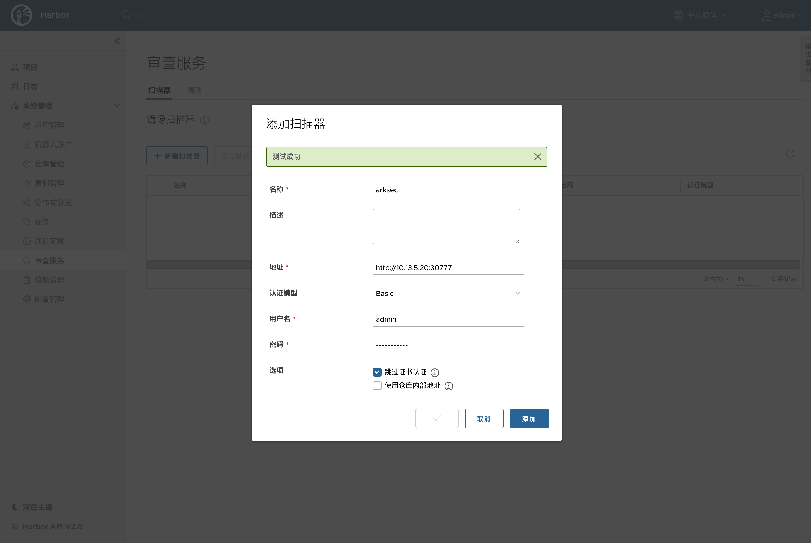
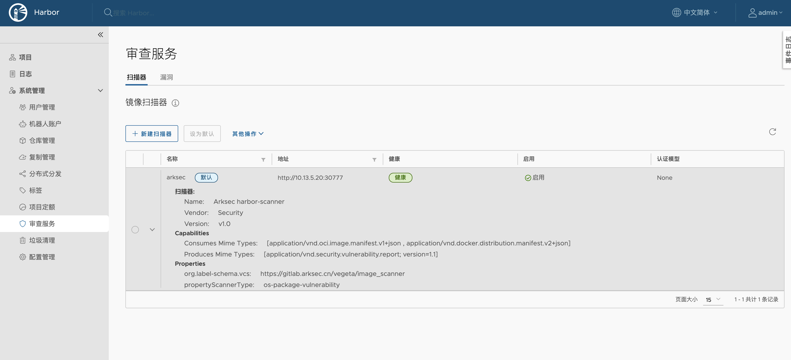
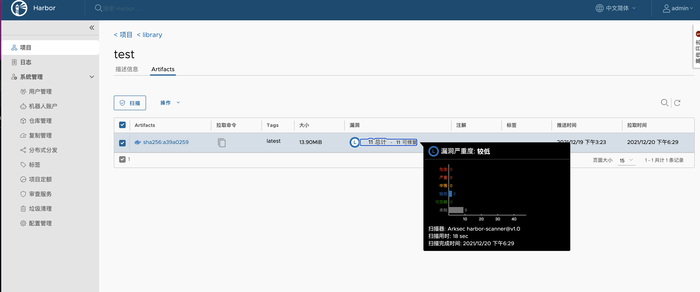

# Arksec Harbor Image Scanner

English | [简体中文]()

`Arksec Harbor Image Scanner` is the scanner which focus on scanning container images in Harbor image repository.

[Arksec Inc](https://www.arksec.cn/) is a start-up security company providing complete cloud native security solution.

## TL;DR

```console
$ kubectl create namespace arksec-system
$ kubectl apply --filename https://raw.githubusercontent.com/arksec-cn/harbor-scanner/main/all-in-one.yaml --namespace arksec-system
```

## Before you begin

### Prerequisites

- Kubernetes 1.16+
- Helm 3+

## Installation

### Installing Scanner with kubectl

To install ArkSec Harbor Scanner on a Kubernetes cluster with kubectl:

1. Run the following command to install ArkSec Harbor Scanner and its dependencies:

```console
$ kubectl create namespace arksec-system
$ kubectl apply --filename https://raw.githubusercontent.com/arksec-cn/harbor-scanner/main/all-in-one.yaml --namespace arksec-system
```

2. Monitor the installation using the following command until all components show a Running status:

```console
$ kubectl get pods --namespace arksec-system --watch 
```

3. The scanner will listen on node port 30777:

```console
$ kubectl get svc --namespace arksec-system
```

### Installing Scanner with helm

To install ArkSec Harbor Scanner on a Kubernetes cluster with helm:

1. Get Chart

```console
$ git clone https://github.com/arksec-cn/harbor-scanner.git
```

<!-- _See [helm repo](https://helm.sh/docs/helm/helm_repo/) for command documentation._ -->

2. Install Chart

```console
$ helm upgrade [RELEASE_NAME] chart/harbor-scanner/ --install --create-namespace --namespace [RELEASE_NAMESPACE]
```

<!-- _See [configuration](#configuration) below._ -->

_See [helm install](https://helm.sh/docs/helm/helm_install/) for command documentation._


## Configuration

1. Add ArkSec Harbor Scanner Adapter



2. Add Succeeded.



3. Scan an artifact



## Uninstall

### Uninstalling Scanner

```console
$ kubectl delete --filename https://raw.githubusercontent.com/arksec-cn/harbor-scanner/main/all-in-one.yaml --namespace arksec-system
$ kubectl delete namespace arksec-system
```

### Uninstalling Scanner with helm

```console
$ helm uninstall [RELEASE_NAME] --namespace [RELEASE_NAMESPACE]
```

This removes all the Kubernetes components associated with the chart and deletes the release.

_See [helm uninstall](https://helm.sh/docs/helm/helm_uninstall/) for command documentation._

# License

Copyright (c) 2020-2021 ArkSec

Licensed under the Apache License, Version 2.0 (the "License");
you may not use this file except in compliance with the License.
You may obtain a copy of the License at

    https://www.apache.org/licenses/LICENSE-2.0

